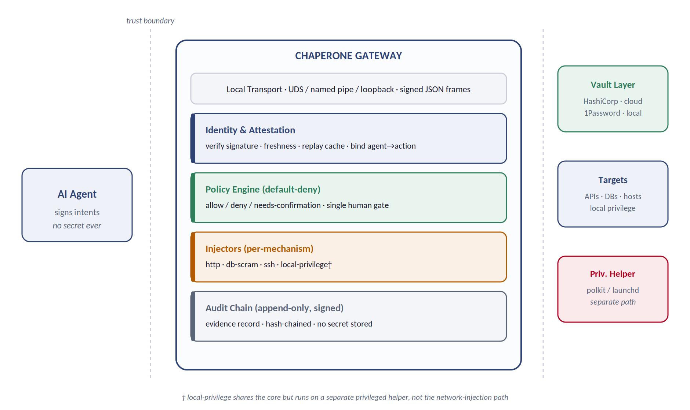
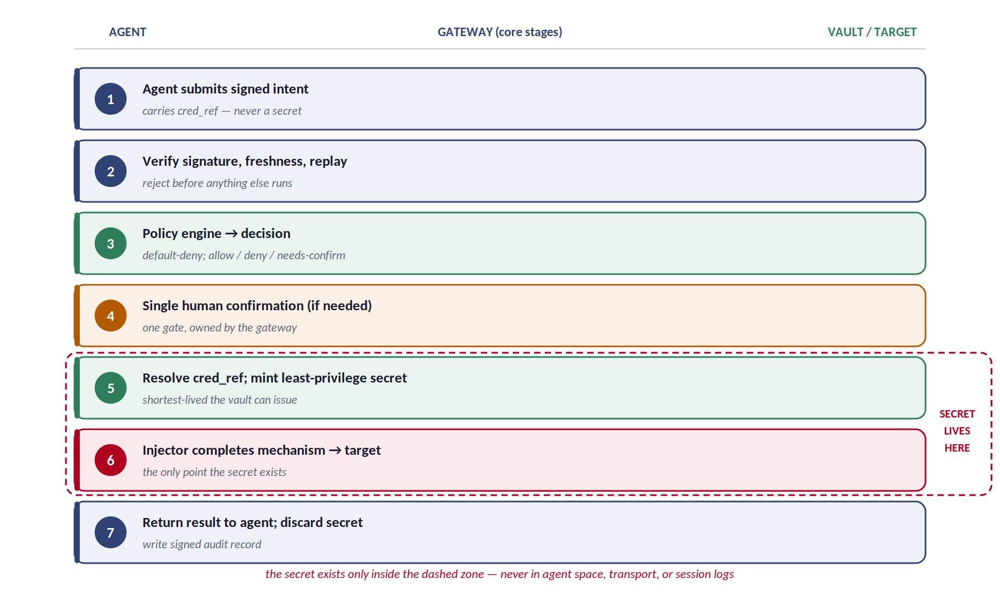
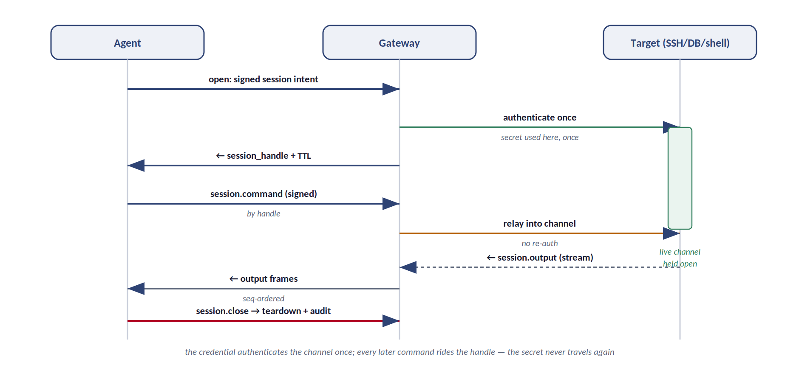

# Chaperone — Architecture Specification

> **Internal structure of the Virtual Interface Security Gateway — vault abstraction, injectors, policy, privilege helper, and audit chain.**

| | |
|---|---|
| **Document** | ARCH-SPEC — Artifact 2 of 4 |
| **Version** | 0.1 (Draft for review) |
| **Status** | Derives from PROTO-SPEC v0.1 |
| **Date** | 22 August 2026 |
| **Governing doc** | [Protocol Specification](01-protocol-spec.md) |
| **Related** | Threat Model · Agent Skill |

---

## 1. Architectural Overview

This document specifies the **internal structure** of the Chaperone gateway: the components behind the wire contract, how they compose, and the invariants each must uphold. It governs implementation. Where the protocol defines *what crosses the socket*, this defines *what happens inside*.

**One process, five concerns.** The gateway is a single local daemon composed of five layers with strict inward dependencies: a transport edge, an identity/attestation layer, a policy engine, a set of mechanism injectors, and an append-only audit chain — with a vault abstraction and a separate privileged helper as the two outward-facing subsystems.

*Figure 1 — The gateway's five internal layers, with the vault abstraction, targets, and privileged helper across the trust boundary. The agent never crosses into gateway space; secrets never cross out.*

> **The one invariant that governs everything.** A secret resolved from a vault MUST NOT be observable outside the injector that consumes it. It is never written to the audit log, never returned to the agent, never placed in a response body or error, and never persisted. Every component boundary below is drawn to preserve this. If a design choice threatens it, the choice is wrong.

### 1.1 Dependency direction

Layers depend **inward and downward only**. Transport knows nothing of injectors; injectors know nothing of transport. The policy engine is the only component that reads the full intent and issues a verdict; the audit chain is written by every layer but read by none of them. This keeps the **attack surface shallow**: a flaw in an HTTP injector cannot reach the signing verification or the vault credentials of another mechanism.

| Layer | Depends on | Never touches |
|---|---|---|
| Transport edge | (nothing internal) | secrets, policy rules |
| Identity / attestation | enrollment key store | vault secrets, injectors |
| Policy engine | identity result, policy store | raw secrets |
| Injectors | vault handle, policy decision | signing keys, other injectors |
| Audit chain | all layers (write-only in) | secrets (records references only) |

---

## 2. Component Responsibilities

### 2.1 Transport edge

Owns the local channel (§3 of the protocol): UDS by default, named pipe on Windows, loopback TCP as fallback. It frames messages, enforces the `Content-Length` protocol, and applies OS-level access control via socket permissions. It performs **no trust decisions** — an authenticated socket peer is still an unauthenticated agent until the identity layer verifies the signature.

### 2.2 Identity & attestation

Verifies every inbound frame per protocol §4: resolves `agent_id` to an enrolled public key, checks freshness and the replay cache, and verifies the Ed25519 signature over the JCS-canonical form **before the mechanism body is parsed**. Public keys live in an enrollment store; the corresponding private keys live in the agents' platform key stores and are never seen here.

> **Enrollment.** Enrollment — binding an `agent_id` to a public key — is an operator action performed through the console, out of scope for this spec. The architecture requires only that the identity layer treats the enrollment store as read-only at request time and that revocation is effective immediately (a revoked key fails at step 1 of verification).

### 2.3 Policy engine

**This is the component that makes Chaperone an authority rather than a proxy.** It receives the verified intent and the resolved agent identity, evaluates the active ruleset, and emits exactly one **decision**: `allow`, `deny`, or `needs_confirmation`. It is **default-deny**: absent an explicit allow, the verdict is deny.

The engine evaluates a request against four axes — **which agent**, **which cred_ref**, **which target**, **which operation** — plus optional constraints (time window, rate, argument pinning). The rule language itself is out of scope here; the architecture fixes only the *shape* of a decision and the guarantee that evaluation is total (every intent yields a verdict) and side-effect-free (evaluation never mints a secret).

| Decision | Engine emits | Next action |
|---|---|---|
| `allow` | verdict + audit stub | proceed to vault resolution |
| `needs_confirmation` | verdict + confirmation prompt payload | block on the single human gate (§2.6) |
| `deny` | verdict + reason code | return `E_DENIED`; nothing is resolved or injected |

### 2.4 Vault abstraction

A uniform interface over heterogeneous secret backends. A `cred_ref` URI names a backend and a path; the abstraction resolves it through the configured **provider driver** and, critically, requests the **narrowest, shortest-lived** credential the backend can mint for the operation — a scoped, expiring token rather than a standing secret wherever the backend supports it.

| Provider driver | `cred_ref` scheme | Dynamic / short-lived support |
|---|---|---|
| HashiCorp Vault | `vault://path` | Yes — dynamic secrets, leases, TTL |
| AWS / GCP / Azure secret managers | `aws://`, `gcp://`, `az://` | Yes — STS / short-lived tokens |
| 1Password / CyberArk | `op://`, `cyberark://` | Partial — per-provider |
| Built-in local vault | `local://path` | User-only CRUD; static by default |

> **The built-in local vault.** For users with no external vault, Chaperone ships its own: an encrypted local store only the end user can perform CRUD against, sealed to the platform key store. It is the fallback, not the flagship — the abstraction is written so that migrating from `local://` to an enterprise backend changes configuration, not agent behavior. The `cred_ref` in an intent stays stable across the move.

### 2.5 Injectors

One module per mechanism. An injector receives a *resolved credential handle* (not the raw secret — a scoped accessor the injector uses and releases) plus the operation body, and completes the mechanism on the outbound side. Injectors are the **only components that touch secret material**, and each touches only its own.

| Injector | Completes | Lifecycle |
|---|---|---|
| `http` | attaches `Authorization` (bearer/basic); re-originates TLS to the real target | one-shot |
| `db-scram` | answers the SCRAM challenge in the DB wire protocol | one-shot or session |
| `ssh` | signs the SSH auth challenge with a vault-held key; holds the pty | session |
| `local-privilege` | brokers a PAM/privilege transaction via the helper (§2.7) | session |

> **Injector plugin ABI.** Injectors are compiled-in for v1 but sit behind a stable internal ABI: `prepare(operation) → plan`, `inject(cred_handle, plan) → channel`, `teardown(channel)`. A future plugin surface can expose this ABI so third parties add mechanisms without forking the core — but a plugin never gains access to the signing layer, the policy store, or any cred_ref it was not handed. `browser-session` is expected to arrive first as a compiled-in injector, then as the reference plugin.

### 2.6 The single confirmation gate

When policy returns `needs_confirmation`, the gateway — not the agent — surfaces one prompt through the operator channel with full context (target label, agent id, mechanism, resolved operation summary). This is the **only** human gate in the system, placed at injection time. The agent's skill instructs it not to raise its own confirmation for credential handling, because that gate has genuinely moved here.

### 2.7 Privileged helper

> **A separate subsystem, deliberately.** Privilege escalation is a different trust model from network injection: it is "run this as root," not "attach a secret to a request." It runs in a separate privileged helper process (polkit-authorized on Linux, launchd-authorized on macOS, an equivalent service on Windows), sharing the vault + policy + audit core but **NOT** the network-injection code path. It always takes the single deliberate confirmation, and runs unattended only against an operator-defined, argument-pinned allowlist. Isolating it means a compromise of any network injector cannot reach root.

### 2.8 Audit chain

Every terminal outcome appends one **signed, hash-chained** record: the full signed intent (as evidence), the decision and who/what confirmed it, the `cred_ref` used (**never the secret**), mechanism, target, timing, and outcome. Each record carries the hash of its predecessor, so any deletion or edit breaks the chain and is detectable. The chain is write-only from inside the gateway; reading and export are operator functions.

> **Why references, not secrets, in the log.** Storing the `cred_ref` rather than the secret is what lets the audit log be exported, reviewed, and retained without itself becoming a credential-leak vector. An auditor can prove exactly which secret was invoked — by reference — without the log ever being able to disclose it. This is the same discipline as the rest of the system: attribution without exposure.

### 2.9 Credential lifecycle and ephemerality

The Threat Model states a security tenet — **secure fragility over durability** (TM §1.3). This section is its implementation contract: the precise rules for how a secret is fetched, held, used, and destroyed. The ordering in §3.1 is not incidental; it exists to serve this tenet.

> **The rule.** A secret is fetched as late as possible — after identity, policy, and confirmation, at the last moment before injection. It is held in a zeroize-on-drop buffer for a single use and scrubbed immediately afterward, on success OR failure. If an operation fails and warrants a retry, the retry re-runs policy and re-fetches a fresh secret from the vault; it MUST NOT reach for a cached copy, because by design none exists. Caching a secret to smooth a retry is prohibited — it is extending the attack vector to buy availability the system has chosen not to want.

The concrete obligations on every injector and the vault layer:

- **Fetch late.** No secret is resolved until the request has passed identity, policy, and any confirmation. A denied or unconfirmed request never touches the vault.
- **Hold minimally.** Secret material lives only in zeroize-on-drop buffers, for the duration of a single injection attempt, and never crosses a process, disk, swap, temp-file, or log boundary — including on error, backoff, and retry paths, which receive special scrutiny because they are where "just in case" copies tend to accumulate.
- **Scrub always.** The buffer is wiped immediately after use, whether the operation succeeded or failed. There is no success path and no failure path on which a secret survives the attempt.
- **Re-fetch on retry.** A retry is a fresh fetch. Prefer the vault minting a new short-lived credential each time, so even the value differs between attempts and a secret scraped from a failed attempt is already stale.

> **Secret vs. channel — the one thing that may persist.** The secret is never reused; the *authenticated channel* it produces is a different object and may persist. In a brokered session the credential completes one handshake and is scrubbed — the resulting authenticated socket or pty stays open and is driven by handle. A channel cannot be replayed to authenticate elsewhere and does not reveal the establishing key, so "no reuse of the secret" and "authenticate once per session" are consistent. This is the boundary between §6.1 (one-shot: fetch, use, scrub) and §6.2 (session: fetch, handshake, scrub, hold the channel).

**The cost is intended.** This yields more vault round-trips and occasional latency, and turns some transient failures that a cache would have masked into visible retries. That is the tenet working: the failures are loud and safe; the alternative — holding the key longer — would be quiet and dangerous. No later optimization may "fix" the retries by introducing a cache.

---

## 3. End-to-End Dataflows

### 3.1 One-shot invocation

The common path for HTTP and single DB operations. The numbered stages map one-to-one to the protocol lifecycle (§6.1). Note where the secret comes into existence and where it is destroyed — the dashed zone is the **entire** lifetime of any secret in the system.

*Figure 2 — One-shot dataflow. Verification and policy precede any secret resolution; the secret exists only across stages 5–6 and is discarded before the result returns.*

### 3.2 Brokered session

For SSH, privileged shells, and long-lived DB connections. The credential authenticates the channel **once**; the agent then drives the live channel by handle. Every session frame is independently signed and owner-bound (protocol §8), so a stolen handle is useless without the opener's key.

*Figure 3 — Brokered session. The secret is spent at authentication and never travels again; subsequent commands ride the handle and are relayed without re-auth.*

> **Why the two flows share one core.** Both flows run the identical identity → policy → (confirm) → resolve sequence. They diverge only after injection: one-shot returns a result and discards; session returns a handle and holds. Sharing the core means the security-critical decisions — who, what, whether — are made in exactly one place, evaluated the same way regardless of mechanism.

---

## 4. Deployment, Platform, and Language

### 4.1 Implementation language

The gateway is implemented in **Rust**. The rationale is direct: memory safety without a garbage collector matters for a process that handles secret material (no surprise pauses, no uncontrolled heap copies of sensitive buffers), the ecosystem has mature crates for the primitives (Ed25519, JCS, TLS, platform key stores), and a single codebase cross-compiles cleanly to Linux, macOS, and Windows. Secret-bearing buffers use zeroize-on-drop types so credential material is scrubbed from memory the moment an injector releases it — which is precisely the ephemerality tenet of §2.9 made enforceable by the type system rather than by discipline. A GC'd language would undermine this: it may copy or retain buffers out of the programmer's control, exactly the durability the tenet forbids.

### 4.2 Platform matrix

| Concern | Linux | macOS | Windows |
|---|---|---|---|
| Local transport | UDS | UDS | named pipe |
| Agent key custody | kernel keyring / TPM | Secure Enclave / Keychain | TPM / DPAPI |
| Privileged helper | polkit | launchd-authorized | service + UAC |
| Vault: local store seal | kernel keyring | Keychain | DPAPI |

### 4.3 Process model

- **Main daemon** (unprivileged): transport, identity, policy, injectors, audit, vault drivers.
- **Privileged helper** (elevated, minimal): only the local-privilege subsystem; communicates with the daemon over an authenticated local channel.
- **No network listener** by default: the daemon makes *outbound* connections to targets and vaults but accepts *inbound* only on the local socket.

### 4.4 Optional hardware-backed mode

v1 ships **software-only by default**, so it runs anywhere. Where the platform supports it, an operator MAY enable a **hardware-backed mode** at install, in which signing and credential injection occur inside a TPM, Secure Enclave, HSM, or confidential-computing enclave (SGX / SEV). The secret then never enters memory the kernel can introspect.

> **How this composes with §2.9.** The ephemerality tenet shrinks *how long* a secret is exposed in ordinary memory; the enclave shrinks *where* it exists at all. They are independent axes and reinforce each other: with both, an attacker must win the race against immediate zeroization AND reach into memory the kernel cannot see. Enclave mode does not eliminate a present, active root attacker (who can still invoke the enclave to do work), but it converts "root exfiltrates standing secrets" into "root can misuse them while present but cannot take them." See Threat Model §5.2.

---

*Related artifacts: the [Protocol Specification](01-protocol-spec.md) (the wire contract this structure serves), the [Threat Model](03-threat-model.md) (adversaries, the confused-deputy analysis, the secure-fragility tenet, and hardening/enclave deployment), and the [Agent Skill](04-agent-skill.md).*
