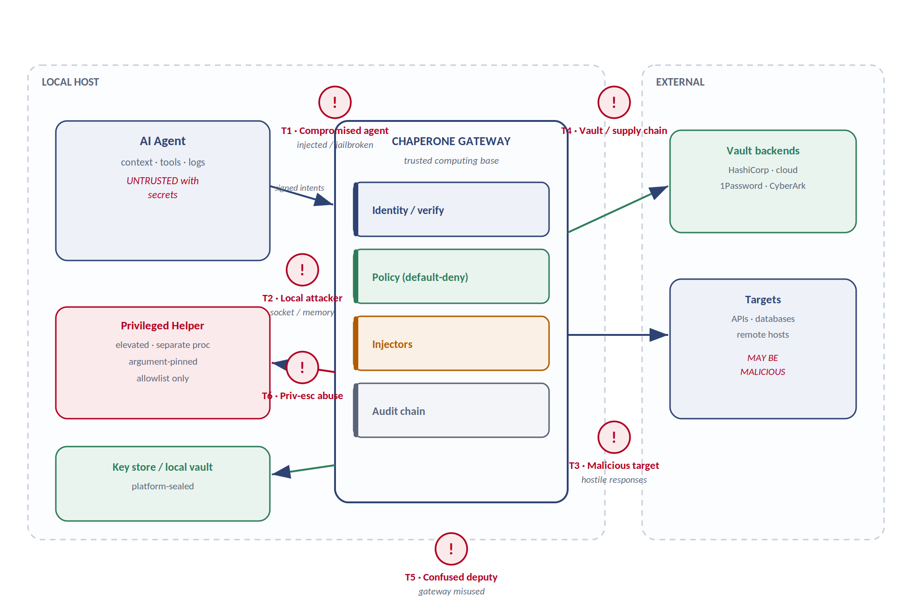
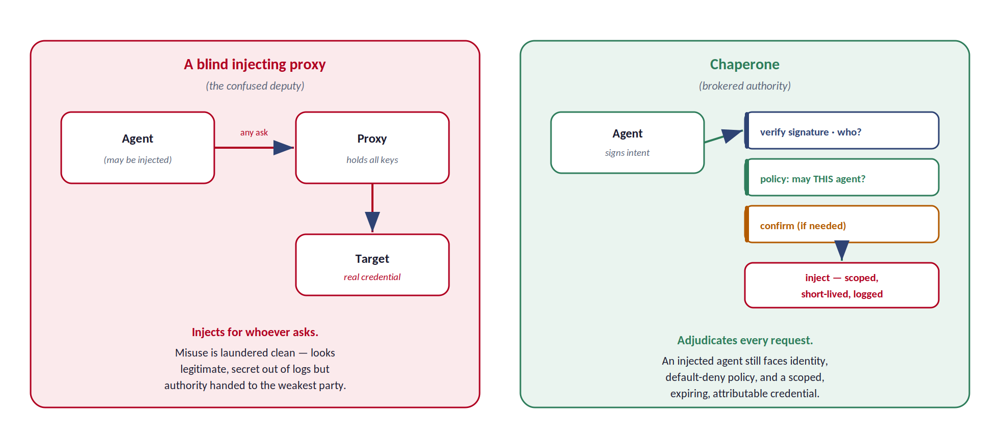

# Chaperone — Threat Model

> **Adversaries, the confused-deputy analysis, and how each architectural boundary maps to a mitigation.**

| | |
|---|---|
| **Document** | THREAT-MODEL — Artifact 3 of 4 |
| **Version** | 0.1 (Draft for review) |
| **Status** | Derives from PROTO-SPEC & ARCH-SPEC v0.1 |
| **Date** | 22 August 2026 |
| **Method** | STRIDE + confused-deputy analysis |
| **Related** | Protocol Spec · Architecture Spec · Agent Skill |

---

## 1. Scope, Method, and Assets

This document analyzes what can go wrong with Chaperone and how the design defends against it. It uses **STRIDE** to enumerate threats per boundary, gives special treatment to the **confused-deputy** problem that is inherent to any credential broker, and closes with a table mapping every architectural boundary to the specific attack it defeats.

### 1.1 The assets under protection

| Asset | Why it matters | Exposure if lost |
|---|---|---|
| Credentials / secrets | The keys to every target system. | Full compromise of the target; the exact harm Chaperone exists to prevent. |
| Agent signing keys | Establish who issued an intent. | Attacker can forge intents and impersonate a trusted agent. |
| Policy ruleset | Decides what any agent may do. | Silent widening of authority; default-deny defeated. |
| Audit chain | The evidence record. | Loss of attribution; undetectable misuse. |
| The gateway process itself | Holds the trust of the whole system. | Everything above. |

### 1.2 Trust assumptions

- **The gateway process is the trusted computing base.** If the gateway binary is subverted, no property holds. Integrity of the binary and its host is assumed and defended by supply-chain controls (§5), not by the protocol.
- **The agent is NOT trusted with secrets.** This is the central assumption. An agent may be well-behaved today and prompt-injected the next request. The design treats every agent as potentially hostile at any moment.
- **The platform key store is trusted** to hold private keys and seal the local vault. This is the same root of trust the OS already relies on.
- **Targets and vault backends are outside the trust boundary.** A target may be malicious or compromised; the gateway defends itself from hostile responses.

Two of these — binary integrity and the absence of a root-level local attacker — are members of the trusted computing base and cannot be defended from inside the gateway. They are treated as **documented handoffs**, not shrugs: §5 names the specific control that picks up each one.

### 1.3 Design tenet: secure fragility over durability

> **The tenet.** A credential is the most fragile data in the system. It is fetched as late as possible, held in the fewest places for the shortest time, and scrubbed the instant it is used — on success or failure alike. When confidentiality and availability conflict, fragility wins. A failed credential operation is answered by re-fetching a fresh secret, NEVER by making the secret more durable to avoid the re-fetch. Caching a key to smooth a retry is extending the attack vector, and is prohibited.

This inverts the ordinary engineering instinct, which makes fragile data durable so retries are cheap. Here a retry is cheap and safe; a cached secret is not — so the system spends retries freely to buy minimal secret lifetime. The cost is real and intended: more vault round-trips, occasional added latency, and failures that a cache would have masked now surface loudly. That is the principle working, not failing — the failures are safe, and the thing it refuses to do (hold the key longer) would be quiet and dangerous. The concrete lifecycle mechanics are specified in the Architecture Specification (§2.9); this is the security rationale for them.

One distinction the tenet depends on: the **secret** is never reused, but the **authenticated channel** a secret produces is a different object and may persist. In a brokered session the credential completes one handshake and is scrubbed; the resulting authenticated socket or pty stays open and is driven by handle. A channel cannot be replayed to authenticate elsewhere and does not reveal the key that established it — so "no reuse of the secret" and "authenticate once per session" are consistent, not in tension.

---

## 2. Adversaries and Attack Surface

Six adversary classes sit at distinct points relative to the trust boundary. The map below places each; the sections that follow analyze them in STRIDE terms.

*Figure 1 — Trust-boundary map. The agent is inside the local host but outside the gateway's trust; targets and vaults are external. Threat classes T1–T6 are annotated at the point where each operates.*

### 2.1 T1 — Compromised agent (the primary adversary)

**The design assumption, not an edge case.** An agent may be prompt-injected by hostile content it reads, jailbroken, or simply buggy. It has legitimate access to the gateway socket and can submit well-formed intents. This is the adversary Chaperone is built around.

| STRIDE | Threat | Primary defense |
|---|---|---|
| Spoofing | Agent claims another agent's identity to borrow its authority. | Per-agent signing key in the platform key store; an agent cannot sign as another (§4 protocol). Forgery requires the victim's private key, which never leaves its keystore. |
| Tampering | Agent alters a signed intent after signing to hit a different target. | Signature covers target + mechanism + cred_ref + operation jointly; any change invalidates it. |
| Elevation | Injected agent asks the gateway to wield a credential it shouldn't. | Default-deny policy scoped per agent × cred_ref × target × operation. Legitimate socket access grants nothing by itself. |
| Info disclosure | Agent tries to read the secret it's invoking. | Secret is never returned — only results or a session handle. No intent shape yields the raw credential. |

> **The key insight for T1.** Chaperone does not try to keep the agent uncompromised — an impossible goal. It makes a compromised agent *low-value*: it can only ever ask, every ask is attributed to its key, every ask is adjudicated against default-deny policy, and even a granted ask yields a scoped, short-lived, fully-logged credential it never sees. The blast radius of a fully hijacked agent is bounded by policy, not by the agent's good behavior.

### 2.2 T2 — Local attacker

A non-root local process trying to reach the socket, or read gateway memory. **Defenses:** owner-only socket permissions (`0600`) so only the gateway's own user can connect; unenrolled callers fail identity verification even if they reach the socket; secret-bearing buffers are zeroize-on-drop (arch §4.1) to shrink the memory-scraping window. A root-level local attacker is out of scope — they own the TCB.

### 2.3 T3 — Malicious target

The endpoint the agent is acting against may be hostile or compromised, returning oversized, malformed, or injection-laden responses. **Defenses:** the gateway treats all target output as untrusted data, enforces `max_response_bytes` and timeouts, and never interprets a response as an instruction. Response content is relayed to the agent as data, never executed by the gateway.

### 2.4 T4 — Vault / supply chain

A compromised dependency, a malicious injector plugin, or a subverted build. **Defenses:** v1 injectors are compiled-in (arch §2.5), not loaded at runtime; the plugin ABI, when it ships, denies plugins access to the signing layer, the policy store, and any `cred_ref` not handed to them. Reproducible builds and signed releases defend the binary. Vault credentials are fetched over authenticated channels the operator configures.

### 2.5 T6 — Privilege-escalation abuse

An attempt to turn the `local-privilege` mechanism into an unattended root shell. **Defenses:** the privileged helper is a separate process (arch §2.7), always takes the single deliberate confirmation, and runs unattended only against an operator-defined, argument-pinned allowlist. A compromise of any network injector cannot reach it — they share no code path.

---

## 3. The Confused-Deputy Problem (T5)

**This is the threat inherent to the entire product category, and the one the design most deliberately answers.** A credential broker holds keys and authenticates on behalf of whoever asks. Done naively, it is a machine for laundering misuse: an injected agent gets the broker to wield real credentials it can never see, and the malicious action arrives at the target looking perfectly legitimate. Moving the secret out of the logs while moving the *authorization decision* into the least trustworthy component would be a net loss.

*Figure 2 — A blind injecting proxy (left) authenticates for anyone who asks; misuse is laundered clean. Chaperone (right) adjudicates every request through identity, default-deny policy, and a single confirmation before any scoped, short-lived credential is injected.*

Chaperone answers T5 by refusing to be a blind injector. The four properties that turn the broker from a liability into a control:

1. **Attribution before action.** Every intent is verified against the issuing agent's key before anything runs. The deputy always knows exactly who is asking.
2. **Default-deny adjudication.** The gateway decides whether *this* agent may invoke *this* cred_ref against *this* target for *this* operation. Absent an explicit allow, it refuses.
3. **Least-privilege, time-boxed secrets.** Even a granted request yields the narrowest, shortest-lived credential the vault can mint — so a successful misuse is small and expires.
4. **The single human gate.** High-risk operations block on one deliberate confirmation, surfaced by the gateway with full context, before injection.

> **Why this is the same question as "rigorous vs. skeleton key."** A broker that injects whatever is asked is a skeleton key with good logging. A broker that adjudicates, attributes, scopes, and gates is a security control. The difference is entirely in the four properties above — which is why the policy engine and signed identity are specified as mandatory, not optional. Remove either and Chaperone collapses back into the confused deputy it was designed to replace.

---

## 4. Residual Risks and Non-Goals

No design eliminates all risk. Stated plainly, so operators calibrate:

| Residual risk | Status | Rationale / compensating control |
|---|---|---|
| Gateway binary subversion | Handed off (§5) | The gateway is the TCB. Defended by reproducible builds, signed releases, and optional attested boot — see §5, not the protocol. If it falls, nothing holds. |
| Root-level local attacker | Handed off (§5) | Owns the key store and process memory; no user-space design defends against the platform owner. Blast radius is reduced by least-privilege short-lived minting (a scraped secret expires in minutes) and, optionally, by keeping secrets in an enclave the kernel cannot introspect (§5). |
| Over-broad policy authored by operator | Accepted | Chaperone enforces policy faithfully; it cannot tell that a human wrote a bad rule. Least-privilege defaults and audit review are the compensations. |
| A granted-then-misused credential | Bounded | Cannot be prevented once policy allows, but is scoped, short-lived, and fully attributed — blast radius and forensics are strong. |
| Confirmation fatigue | Design tension | Too many prompts train humans to click through. The single-gate design and needs-confirmation-only-when-warranted posture manage this; it remains a tuning problem. |

---

## 5. Hardening and High-Assurance Deployment

The two trusted-computing-base non-goals from §1.2 — binary integrity and root-level local attackers — cannot be defended by the gateway from inside itself. This section names the controls that pick up each handoff, so "out of scope for the protocol" means "defended by a specific control here," not "ignored."

### 5.1 Binary integrity

Answering "is this the real, untampered gateway?" requires something outside the code, since a subverted binary will not honestly report itself. The layered controls:

- **Reproducible builds.** The binary is byte-for-byte reproducible from source, so anyone can independently verify that a release corresponds to auditable code.
- **Signed releases.** Releases are cryptographically signed; the OS package manager and code-signing enforcement (Gatekeeper, signed packages, Authenticode) refuse to run a tampered binary.
- **Measured / attested boot (high-assurance).** Where a TPM is present, the boot chain is measured and the running gateway can be remotely attested — a verifier gets cryptographic proof of exactly which binary is executing before trusting it with vault access.

### 5.2 Reducing the root-attacker blast radius

Root owns the kernel and therefore the machine; no user-space design defends against it. Chaperone does not pretend to — it **reduces the value of a root compromise** along two axes:

- **Shrink the time (fragility).** Per the §1.3 tenet, secrets exist in ordinary memory for a single handshake and are scrubbed immediately. A root attacker scraping process memory must win a race against zeroization, and what they catch is a least-privilege, short-lived credential that expires in minutes — not a standing key.
- **Shrink the place (enclave).** Optionally, signing and injection happen inside a hardware-backed enclave — TPM, Secure Enclave, HSM, or a confidential-computing enclave (SGX / SEV) — so the secret never enters memory the kernel can introspect. Root can still invoke the enclave to do work while present (the confused-deputy problem in hardware form), but cannot exfiltrate the secret for later use.

> **Enclave mode: optional at install, software-only default.** v1 ships software-only so it runs anywhere. A high-assurance operator can enable hardware backing at install where the platform supports it. The two axes compose: fragility shrinks how long a secret is exposed; the enclave shrinks where it exists at all. Together an attacker must both win the race against immediate zeroization AND reach into memory the kernel cannot see — belt and suspenders, reinforcing rather than duplicating.

### 5.3 What hardening does not buy

Honesty about the ceiling: none of this defends against a root attacker who is *present and active* at the moment of use — they can invoke the enclave, drive the gateway, or replace it before the next attested boot. Hardening converts *"root steals your standing secrets for later"* into *"root can misuse them while present but cannot exfiltrate them"* — a real and worthwhile downgrade in blast radius, but not the elimination of the root threat, which no host-resident secret handler can promise.

---

## 6. Boundary-to-Mitigation Map

The payoff table. Each architectural boundary from the Architecture Specification is here shown as the answer to a specific threat — demonstrating the boundaries were drawn for security reasons, not incidental structure.

| Architectural boundary (ARCH-SPEC) | Defeats | How |
|---|---|---|
| Signed intents; keys in platform store (§2.2) | T1 spoofing/tampering | No agent can forge another's intent or alter its own post-signing. |
| Default-deny policy engine (§2.3) | T1 elevation, T5 | Legitimate access grants nothing; every action is adjudicated per four axes. |
| Secret never leaves injector (§1 invariant) | T1 disclosure, T2 | No code path returns or logs a raw secret; nothing to scrape from responses. |
| Least-privilege vault minting (§2.4) | T1, T5 blast radius | A misused credential is scoped and expiring, not a standing god-key. |
| Owner-only socket (§2.1) | T2 | Only the gateway's own user can connect; others never reach identity. |
| Inward-only dependencies (§1.1) | T4 | A flaw in one injector cannot reach signing, policy, or another mechanism's secret. |
| Compiled-in injectors / constrained ABI (§2.5) | T4 | No runtime code loading in v1; plugins never touch signing or unowned cred_refs. |
| Separate privileged helper (§2.7) | T6 | Network-injector compromise shares no code path with root; helper is allowlist-gated. |
| Hash-chained audit (§2.8) | T1, T5 detection | Every action attributed and tamper-evident; misuse cannot hide. |
| Single confirmation gate (§2.6) | T5, T6 | One deliberate human decision at injection for high-risk actions. |

---

*Related artifacts: [Protocol Specification](01-protocol-spec.md) · [Architecture Specification](02-architecture-spec.md) · [Agent Skill](04-agent-skill.md).*
